# Links:
```code 
1. code: https://github.com/chasebk/code_OTWO_ELM
2. paper: https://github.com/chasebk/paper_OTWO_ELM
```

# Model comparison (normal and stability)
1. MLNN
2. ELM
3. GA-ELM
4. PSO-ELM
5. TWO-ELM
6. OTWO-ELM


# Project structure
1. General view class
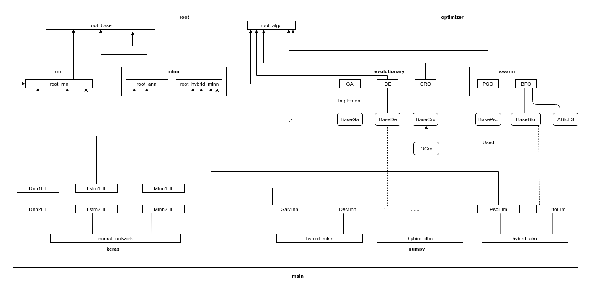

2. Details view class
* root files

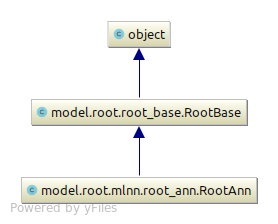 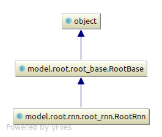 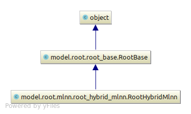

* algorithm files

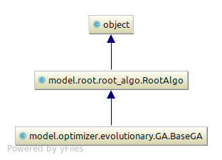 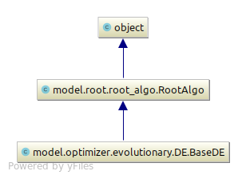 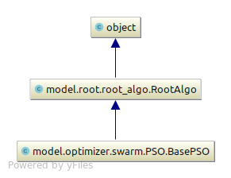

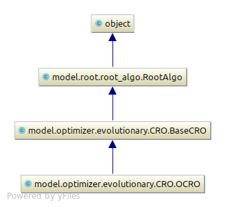 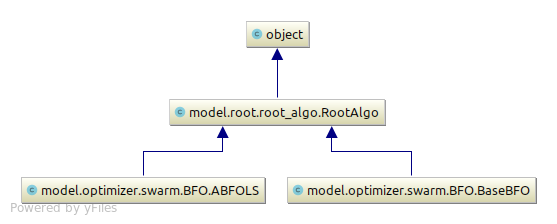

* main files

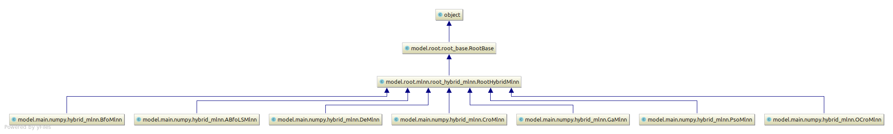

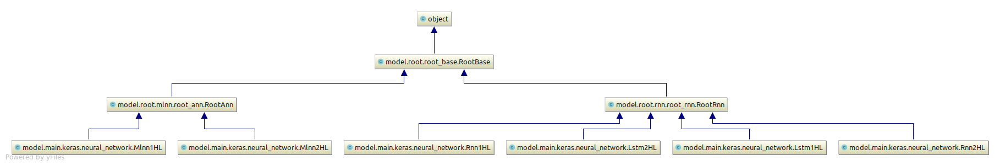


## Optimized the number of hidden neuron in hidden layer
```code
https://iopscience.iop.org/article/10.1088/1757-899X/261/1/012002/pdf
https://sci-hub.tw/10.1016/j.neucom.2011.12.062
https://arxiv.org/pdf/1501.06115.pdf
https://www.researchgate.net/publication/271201213_A_detailed_analysis_on_extreme_learning_machine_and_novel_approaches_based_on_ELM
https://www.researchgate.net/post/Can_anyone_help_with_Training_Extreme_Learning_Machines_neural_network_on_very_Large_Datasets
https://www.sciencedirect.com/science/article/pii/S2212671612002181
http://www3.ntu.edu.sg/home/ASAHTan/Papers/2008/ELM%20NEUCOM%2008.pdf
http://or.nsfc.gov.cn/bitstream/00001903-5/112878/1/1000004116461.pdf

```


## Server Errors
```code
1. Maybe multi-threading error between numpy and openBlas
- We should check what is the core-backend of numpy in server: blas or mkl
	python
    import numpy
    numpy.__config__.show()
    
https://stackoverflow.com/questions/17053671/python-how-do-you-stop-numpy-from-multithreading
https://stackoverflow.com/questions/19257070/unintented-multithreading-in-python-scikit-learn

- Numpy will consume so much time when running multi-thread because the time for exchanging data among cores. 
So we should prevent numpy running multi-thread on server.

Adding to the file:  ~/.bashrc or ~/.bash_profile:
    export OPENBLAS_NUM_THREADS=1   (If OpenBlas)
    export MKL_NUM_THREADS=1        (If MKL)

    export OPENBLAS_NUM_THREADS=1 
    export MKL_NUM_THREADS=1 
    
    source ~/.bashrc

2. Cannot share object related to matplotlib on server
    sudo apt update
    sudo apt install libgl1-mesa-glx
```


