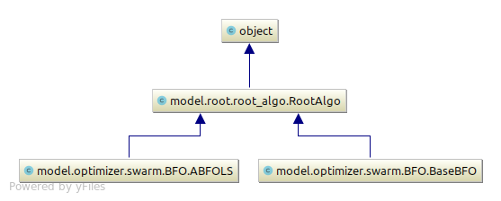

# Links:
```code 
1. git: https://github.com/thieunguyen5991/two_elm/
2. paper: https://bitbucket.org/nguyenthieu2102/paper_two/
```

## Model comparison
1. MLNN
2. ELM
3. GA-ELM
4. PSO-ELM
5. TWO-ELM
6. ITWO-ELM


=== Running ====
1. MLNN (normal mode)

==> Last: MLNN (stability mode)


## Optimized the number of hidden neuron in hidden layer
```code
https://iopscience.iop.org/article/10.1088/1757-899X/261/1/012002/pdf
https://sci-hub.tw/10.1016/j.neucom.2011.12.062
https://arxiv.org/pdf/1501.06115.pdf
https://www.researchgate.net/publication/271201213_A_detailed_analysis_on_extreme_learning_machine_and_novel_approaches_based_on_ELM
https://www.researchgate.net/post/Can_anyone_help_with_Training_Extreme_Learning_Machines_neural_network_on_very_Large_Datasets
https://www.sciencedirect.com/science/article/pii/S2212671612002181
http://www3.ntu.edu.sg/home/ASAHTan/Papers/2008/ELM%20NEUCOM%2008.pdf
http://or.nsfc.gov.cn/bitstream/00001903-5/112878/1/1000004116461.pdf

```


# Project structure
1. General view class


2. Details view class
* root files

  

* algorithm files

  

 

* main files


## Server Errors: Check lỗi multi-threading giữa numpy và openBlas
Ta phải check xem core-backend của numpy nó đang dùng thư viện hỗ trợ nào : blas hay mkl
    python
    import numpy
    numpy.__config__.show()
    
https://stackoverflow.com/questions/17053671/python-how-do-you-stop-numpy-from-multithreading
https://stackoverflow.com/questions/19257070/unintented-multithreading-in-python-scikit-learn

---> Để chặn numpy không chạy multi-thread sẽ tốn thời gian trao đổi:
Thêm vào file ~/.bashrc hoặc ~/.bash_profile dòng sau:
    export OPENBLAS_NUM_THREADS=1   (Nếu dùng OpenBlas)
    export MKL_NUM_THREADS=1        (Nếu dùng MKL)

    export OPENBLAS_NUM_THREADS=1  
    export MKL_NUM_THREADS=1       
    
    source ~/.bashrc

## Neu bi loi: Cannot share object lien quan den matplotlib tren server thi sua nhu sau:
```
    sudo apt update
    sudo apt install libgl1-mesa-glx
```
